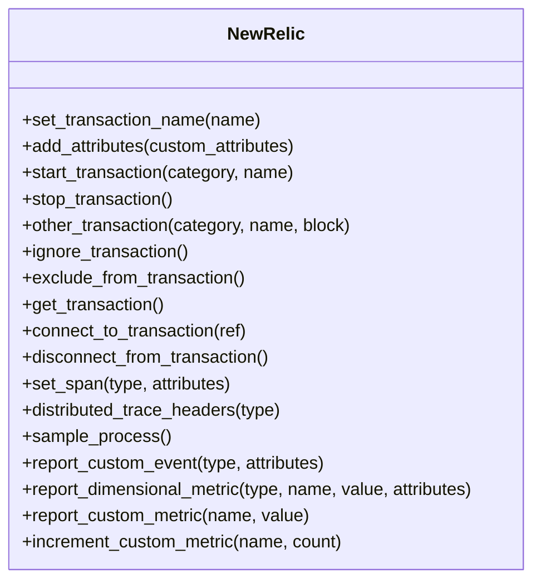

# Modules

## NewRelic

Main entry-point/context for the NewRelic Elixir Agent.

# NewRelic.Init
Initializes [`NewRelic.Config`](#newrelicconfig) settings.

# NewRelic.Config
Maintains config state cache.
